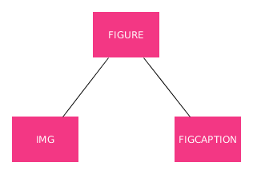

# Imágenes

- [Imágenes](#imágenes)
  - [Imágene simples](#imágene-simples)
  - [Rutas](#rutas)
  - [Figuras](#figuras)
  - [Enlaces](#enlaces)
  - [Enlaces dentro de la misma página](#enlaces-dentro-de-la-misma-página)

Tras añadir elementos de texto a nuestra página, al cuerpo de la misma, vamos a continuar mejorando y haciendo nuestras webs más bonitas e interactivas.

Para ello, en este apartado vamos a añadir dos elementos básicos en toda web:

- Las imágenes
- Los enlaces

Y además, conoceremos qué es una ruta y las clases que hay ya que, estos dos elementos anteriores, van a utilizar rutas en sus atributos.

## Imágene simples

La inclusión de imágenes simples se viene haciendo desde las primeras versiones de HTML con la etiqueta sin contenido ``

Los atributos más comunes que le podemos poner a esta etiqueta son:

- `src`: que indica la ruta en la que se encuentra el archivo de la imagen.
- `alt`: un texto alternativo para describir la imagen en caso de que no se cargue o para dispositivos especiales para usuarios con discapacidad visual.
- `width`: para especificar la anchura de la imagen (px, % etc..). Si no se escogerá la anchura propia de la misma.
- `height`: para especificar la altura de la imagen (px, % etc..). Si no se escogerá la altura propia de la misma.

Es importante destacar que la imagen es un elemento en línea que se pone, si cabe, inmediatamente después de los elementos previamente añadidos.

Algunos ejemplos de utilización de estos atributos podrían ser:

```html
<!-- Si no pongo nada se respetan las dimensiones originales de la imagen-->
<!-- Ruta relativa -->


<!-- Ruta absoluta -->


<!-- Ruta URL -->


<!-- Si modifico una dimensión se respetan las proporciones-->


<!-- Si pongo ambas dimensiones puedo modificar las proporciones-->

```

## Rutas

El concepto de ruta es un concepto muy importante ya que se utiliza es muchos temas relacionados con la informática y en concreto, en la creación de páginas WEB, se utiliza para referenciar archivos, recursos y/o partes de alguna web. De manera general podemos distinguir:

- Relativas: Toman como base el directorio en el que se encuentra nuestro fichero. Son las recomendadas.
```html

```
- Absolutas: Toman como base el directorio raíz de mi equipo (/ en Linux y c:\ en Windows). Cuidado, sólo funcionarán en tu mismo equipo.
```html

```
- Url: La dirección de Internet de un recurso (fichero, imagen etc..). Puede desaparecer y entonces dejará de mostrarse en nuestra web.

```html 

```
## Figuras

Una novedad en HTML5 es la construcción de etiquetas alrededor de la etiqueta ``, lo que nos va a permitir mostrar una imagen con un texto asociado.

En este caso el árbol DOM será el siguiente:



Dónde:

- `<figure>`es la etiqueta padre
- `` es una etiqueta de imagen
- `<figcaption>` es una etiqueta que contendrá el texto asociado a al imagen

Por ejemplo:

```html
<figure>
    
    <figcaption>Logotipo de GitHub</figcaption>
</figure>
```
## Enlaces

Los enlaces, que se representan mediante el uso de la etiqueta `<a>` es una de las contrucciones más importantes en HTML. Esta etiqueta puede tener varios atributos, de lo cuales los más importante son:

- `href`: que es la dirección de Internet de destino (ya sea otra página web, un imagen, un fichero o lo que sea).
- `target`: que indica dónde voy a abrir ese enlace. Si no pongo nada se abrirá en la misma pantalla y si le doy el valor `target=”_blank”` se abrirá en una nueva ventana de mi navegador.

Varios ejemplos de enlaces:

```html
<p><a href="http://www.github.com">Esto abre un enlace en la propia página</a></p>

 <p><a href="http://www.github.com" target="_blank">Esto abre un enlace en una pestaña nueva</a></p>

<!-- Haciendo que una imagen sea enlace. Anidando etiquetas -->
<a href="http://www.github.com"></a>
```
## Enlaces dentro de la misma página

Puedo enlazar enlaces dentro de la misma página con construcciones como la siguiente:

```html
    ...
    <a href="#contacto">Contacto</a>
    ...
    <section id="contacto">
        .....
    </section>
    ....
```