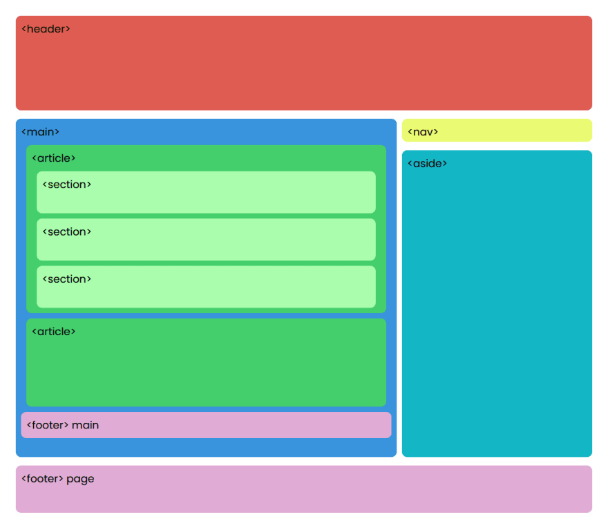
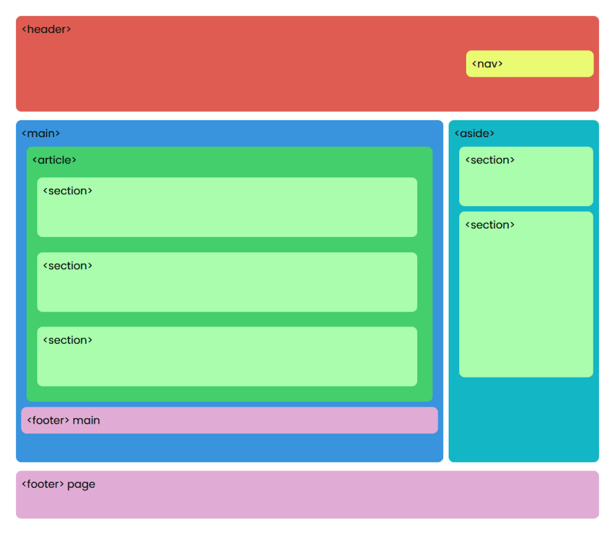

# ETIQUETAS SEMÁNTICAS

Las etiquetas semánticas son nuevas etiquetas, que aparecen con la versión HTML5, y que sirven para que desarrolladores, navegadores y buscadores entiendan mejor qué tipo de contenido tienen ciertas secciones o partes de nuestra web.

Las etiquetas semánticas que existen son las siguientes:

- details
- dialog
- summary

`<header>` Representa un grupo de ayudas introductorias o de navegación.
También puede contener logos, formulario de búsqueda o tabla de contenidos.

`<nav>` Sección de una página que enlaza a otras páginas o partes de la misma. Una sección con links de navegación.

`<aside>` Sección de una pagina que contiene contenido relacionado tangencialmente al de su alrededor. Por lo general se utilizan como barras laterales.

`<main>` Representa el contenido predominante de la página.
Una página debe tener solo un tag `<main>`. Solo debe estar contenida por tags de tipo `<html>`, `<body>`, `
` o `<form>`.

`<article>`	Representa una sección de contenido que puede ser distribuido de forma independiente. Puede ser un post en un foro, un articulo de periódico, una entrada de un blog, un comentario, etc.

`<section>`	Representa a una sección genérica de una pagina. Agrupa contenidos que tienen una relación temática entre si.

`<footer>` Representa un pie de página para el elemento que lo contiene.
Generalmente contiene información acerca de quién lo escribió, enlaces a documentos relacionados, datos de derechos de autor o similares.

`
` y `
` La etiqueta `
` define un encabezado visible para el elemento `
` . Se puede hacer clic en el encabezado para ver / ocultar los detalles.

`<dialog>` Elemento que facilita la creación de diálogos emergentes y modales en una página web.

Cuando usamos alguna de estas etiquetas sucede lo siguiente:

- A nivel visual se comportan como una etiqueta `
`.
- Aportan significado, podemos conocer el qué es lo que hay dentro (no como un div). Esto ayuda a buscadores y desarrolladores tal y como se dijo antes.
- Se utilizan para maquetar, como los divs.

## Ejemplos

