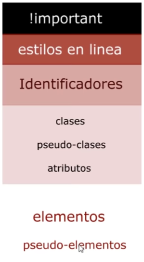

# SUMARIO

- [SUMARIO](#sumario)
- [ESTRUCUTRA CSS](#estrucutra-css)
- [SELECTORES](#selectores)
- [ESPECIFIDAD](#especifidad)
  - [Cómo se calcula](#cómo-se-calcula)
    - [Tipos de selectores](#tipos-de-selectores)
    - [La excepción !important](#la-excepción-important)
- [METODOLOGÍA BEM](#metodología-bem)

# ESTRUCUTRA CSS

La estructura de la hoja CSS se basa en lo siguiente:

```css
selector {
    propiedad: valor;
}
```
# SELECTORES

> Universal: * Selecciona todos los elementos

```css
* {
    color: red;
}
```
> De tipo: <elemento> nombre del elemento 

```css
<footer> {
    color: red;
}
```

> Clases: .class nombre de la clase

```css
.clase {
    color: red;
}
```
> ID: #id nombre del identificador

```css
#id-identificador {
    color: red;
}
```
> Por atributo: 

**html**

```html
<h2 atributo="colorRojo">
```

**css**

```css
[atributo="colorRojo"] {
    color: red;
}
```

> Descendiente

**html**

```html
<h2><p>Soy un subtítulo</p></h2>
<h2>Soy un subtítulo sin color</h2>
```

**css**

```css
h2 p {
    color: red;
}
```

**html**

```html
<h2 class="h2-class"><p>Soy un subtítulo</p></h2>
<h2>Soy un subtítulo sin color</h2>
```

**css**

```css
.h2-class p {
    color: red;
}
```

> Pseudo elementos

TO-DO

> Pseudo clases

Una pseudoclase CSS es una palabra clave que se añade a los selectores y que especifica un estado especial del elemento seleccionado.

Las pseudoclases, junto con los pseudoelementos, permiten aplicar un estilo a un elemento no sólo en relación con el contenido del árbol de documento, sino también en relación a factores externos como el historial del navegador (`:visited`, por ejemplo), el estado de su contenido (como `:checked` en algunos elementos de formulario), o la posición del ratón (como `:hover` que permite saber si el ratón está encima de un elemento o no).

```css
selector:pseudoclase { 
    propiedad: valor; 
}
```

Selecciona para ver un [listado completo de las pseudoclases]([html://](https://developer.mozilla.org/es/docs/Web/CSS/Pseudo-classes)).

```css
/* Cuando pasa el ratón encima de etiquetas h2 el texto se pone de color rojo*/
h2:hover {
    color:red;
}
```

# ESPECIFIDAD

La especificidad es la manera mediante la cual los navegadores deciden qué valores de una propiedad CSS son más relevantes para un elemento y, por lo tanto, serán aplicados. La especificidad está basada en las reglas de coincidencia que están compuestas por diferentes tipos de selectores CSS.

## Cómo se calcula

La especificidad es un peso (importancia o valor) que se le asigna a una declaración CSS dada, determinada por el número correspondiente de cada [tipo de selector](#tipos-de-selectores). Cuando varias declaraciones tienen igual especificidad, se aplicará al elemento la última declaración encontrada en el CSS. La especificidad solo se aplica cuando el mismo elemento es objetivo de múltiples declaraciones. Según las reglas de CSS, en caso de que un elemento sea objeto de una declaración directa, esta siempre tendrá preferencia sobre las reglas heredadas de su ancestro.

### Tipos de selectores

0. Selectores de tipo: como `<h1>` y pseudo-elementos como `::before`
1. Selectores de clase: como `.clase`, selectores de atributo (`[type="radio"]`) y pseudo-clases (`:hover`)
2. Selectores de ID: como `#id-identificador`

El selector universal `*` y la pseudoclase de negación `::not()` no tienen efecto sobre la especifidad. Sin embargo los selectores declarados dentro de `:not()` si lo tienen.

### La excepción !important

Cuando se emplea `!important` en una declaración de estilo, esta sobreescribe a cualquier otra. Es uso de esta excepción es una mala práctica y se debe evitar ya que rompe el estilo en casaca y es más difícil depurar los errores. 

* Busca siempre una manera de emplear la especificidad antes de considerar el uso de `!important`.
* Usa `!important` solo en declaraciones específicas de CSS que sobrescriban CSS externo (de librerías externas como Bootstrap o normalize.css).
* Nunca uses `!important` cuando estés intentando escribir un plugin/mashup.
* Nunca uses `!important` en todo el código CSS.



# METODOLOGÍA BEM

BEM es una de las metodologías mas utilizadas actualmente debido su practicidad frente a otras metodologías y por su capacidad para crear componentes reutilizables y compartir código en el desarrollo web.

Nace de la necesidad de nombrar los elementos a la hora de maquetar un sitio web, estableciendo una convención super fácil, poderosa y simple que permite que tu código sea mucho más fácil de leer y entender.

Para saber más sobre [metodología BEM](Contenidos/MetodologiaBEM.md) pulsa en el enlace.


